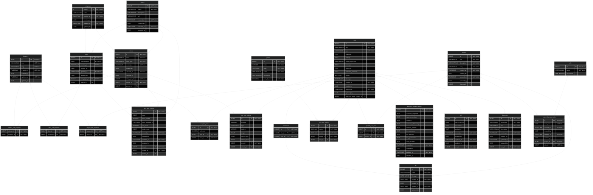

# Database  Structure

🚧 Under construction

ℹ See latest detailed navicat database schema [here](https://drive.google.com/drive/folders/1cooZKF4DGPaROonQ6-KzFYkaEwHLZg2s)

```mermaid
%%{init: { 'theme':'dark', 'sequence': {'useMaxWidth':false} } }%%
erDiagram
    keyword ||--o{ criteria_has_keyword: ""
    keyword ||--o{ idea_has_keyword: ""
    keyword ||--o{ project_has_keyword: ""
    idea ||--o{ idea_and_criteria: ""
    idea ||--o{ idea_has_keyword: ""
    idea ||--|| vcw_has_idea: ""
    entry_type ||--o{ criteria: ""
    entry_type ||--o{ idea: ""
    criteria ||--o{ criteria_has_keyword: ""
    criteria ||--o{ idea_and_criteria: ""
    criteria ||--|| vcw_has_criteria: ""
    source |o--o{ criteria: ""
    source |o--o{ idea: ""
    source |o--o{ idea_and_criteria: ""
    attachment ||--|| file: ""
    phase ||--o{ vcw_has_phase: ""
    vcw ||--o{ vcw_has_idea: ""
    vcw ||--o{ vcw_has_criteria: ""
    vcw ||--|{ vcw_has_phase: ""
    vcw ||--o| project_has_vcw: ""
    vcw ||--o| business_model_canvas: ""
    vcw ||--o{ kpi: ""
    vcw ||--o{ diagnostic: ""
    vcw ||--o{ attachment: ""
    project |o--o| file: ""
    project ||--o{ project_has_vcw: ""
    project ||--|{ project_has_user_role: ""
    project ||--o{ project_has_keyword: ""
    role ||--o{ project_has_user_role: ""

    business_model_canvas {
        BIGINT id PK "NOT NULL"
        TEXT customer_segments 
        TEXT value_propositions 
        TEXT channels 
        TEXT customer_relationships 
        TEXT revenue_streams
        TEXT key_resources
        TEXT key_activities 
        TEXT key_partnerships
        TEXT cost_structure
        TIMESTAMP created_at "NOT NULL"
        UUID created_by 
        TIMESTAMP updated_at "NOT NULL"
        UUID updated_by
    }
    
    entry_type {
        id BIGINT PK "NOT NULL"
        VARCHAR255 name  "NOT NULL"
        TIMESTAMP created_at "NOT NULL"
        UUID created_by 
        TIMESTAMP updated_at "NOT NULL"
        UUID updated_by 
    }
    source {
        BIGINT id PK "NOT NULL"
        VARCHAR255 name "NOT NULL"
        VARCHAR255 description
        VARCHAR255 url 
        TIMESTAMP created_at "NOT NULL"
        UUID created_by 
        TIMESTAMP updated_at "NOT NULL"
        UUID updated_by 
    }

    file {
        BIGINT id PK "NOT NULL"
        VARCHAR1024 name "NOT NULL"
        VARCHAR255 file_type 
        TIMESTAMP created_at "NOT NULL"
        UUID created_by 
        TIMESTAMP updated_at "NOT NULL"
        UUID updated_by 
    }

    keyword {
        BIGINT id PK "NOT NULL"
        VARCHAR128 word  "NOT NULL"
        VARCHAR128 lang  "NOT NULL"
        TIMESTAMP created_at "NOT NULL"
        UUID created_by 
        TIMESTAMP updated_at "NOT NULL"
        UUID updated_by 
    }

    phase {
        BIGINT id PK "NOT NULL"
        INTEGER order "NOT NULL"
        VARCHAR2 code "NOT NULL"
        VARCHAR128 name "NOT NULL"
        VARCHAR2048 description 
        BOOLEAN part_of_sprint "NOT NULL"
    }

    role {
        BIGINT id PK "NOT NULL"
        VARCHAR128 name  "NOT NULL"
        VARCHAR2048 description 
    }

    criteria {
        BIGINT id PK "NOT NULL"
        VARCHAR128 name  "NOT NULL"
        VARCHAR128 value_type  "NOT NULL"
        TIMESTAMP created_at "NOT NULL"
        UUID created_by 
        TIMESTAMP updated_at "NOT NULL"
        UUID updated_by 
        BIGINT entry_type_id "NOT NULL"
        BIGINT criteria_id FK "NOT NULL"
        BIGINT source_id FK
    }

    criteria_has_keyword {
        BIGINT criteria_id FK "NOT NULL"
        BIGINT keyword_id FK "NOT NULL"
    }

    idea {
        BIGINT id PK "NOT NULL"
        name VARCHAR128 "NOT NULL"
        TIMESTAMP created_at "NOT NULL"
        UUID created_by 
        TIMESTAMP updated_at "NOT NULL"
        UUID updated_by 
        BIGINT entry_type_id FK "NOT NULL"
        BIGINT source_id FK
    }


    idea_and_criteria {
        BIGINT id PK "NOT NULL"
        FLOAT value 
        INTEGER value_source 
        TIMESTAMP value_updated_at
        BOOLEAN vcf_result 
        FLOAT mcda_result 
        TIMESTAMP created_at "NOT NULL"
        UUID created_by 
        TIMESTAMP updated_at "NOT NULL"
        UUID updated_by 
        BIGINT idea_id FK "NOT NULL"
        BIGINT criteria_id FK "NOT NULL"
        BIGINT source_id FK
    }

    idea_has_keyword {
        BIGINT idea_id FK "NOT NULL"
        BIGINT keyword_id FK "NOT NULL"
    }

    vcw {
        BIGINT id PK "NOT NULL"
        VARCHAR128 title  "NOT NULL"
        VARCHAR10 type  "NOT NULL"
        TEXT challenge 
        TEXT concept 
        VARCHAR255 value_proposition 
        TEXT prototype 
        TEXT three_ms 
        TEXT executive_summary 
        BOOLEAN closed 
        TIMESTAMP closed_at
        TIMESTAMP created_at "NOT NULL"
        UUID created_by 
        TIMESTAMP updated_at "NOT NULL"
        UUID updated_by 
        BIGINT business_model_canvas_id FK
    }

    kpi {
        BIGINT id PK "NOT NULL"
        name VARCHAR255
        TEXT description 
        TEXT evaluation 
        TIMESTAMP created_at "NOT NULL"
        UUID created_by 
        TIMESTAMP updated_at "NOT NULL"
        UUID updated_by 
        BIGINT vcw_id FK "NOT NULL"
    }

    project {
        BIGINT id PK "NOT NULL"
        VARCHAR128 title  "NOT NULL"
        VARCHAR2048 description  "NOT NULL"
        VARCHAR128 lang  "NOT NULL"
        TIMESTAMP created_at "NOT NULL"
        UUID created_by 
        TIMESTAMP updated_at "NOT NULL"
        UUID updated_by 
        BIGINT thumbnail FK
    }

    project_has_keyword {
        BIGINT keyword_id FK "NOT NULL"
        BIGINT project_id FK "NOT NULL"
    }


    project_has_user_role {
        BIGINT id PK "NOT NULL"
        UUID user_inum  "NOT NULL"
        TIMESTAMP created_at "NOT NULL"
        UUID created_by 
        TIMESTAMP updated_at "NOT NULL"
        UUID updated_by 
        BIGINT project_id FK "NOT NULL"
        BIGINT role_id FK "NOT NULL"
    }

    project_has_vcw {
        BIGINT id PK "NOT NULL"
        BIGINT vcw_id FK "NOT NULL"
        BIGINT project_id FK "NOT NULL"
    }

    attachment {
        BIGINT id PK "NOT NULL"
        BIGINT file_id FK "NOT NULL"
        BIGINT vcw_id FK "NOT NULL"
    }

    diagnostic {
        BIGINT id PK "NOT NULL"
        VARCHAR128 swot_field  "NOT NULL"
        VARCHAR128 title  "NOT NULL"
        VARCHAR1024 description 
        TIMESTAMP created_at "NOT NULL"
        UUID created_by 
        TIMESTAMP updated_at "NOT NULL"
        UUID updated_by 
        BIGINT  vcw_id FK "NOT NULL"
    }

    vcw_has_criteria {
        BIGINT id PK "NOT NULL"
        BOOLEAN selected 
        VARCHAR255 type 
        INTEGER ranking 
        FLOAT weight 
        FLOAT interval_min 
        FLOAT interval_max 
        BIGINT vcw_id FK "NOT NULL"
        BIGINT criteria_id FK "NOT NULL"
    }

    vcw_has_idea {
        BIGINT id PK "NOT NULL"
        BOOLEAN selected 
        BIGINT vcw_id FK "NOT NULL"
        BIGINT idea_id FK "NOT NULL"
    }

    vcw_has_phase {
        BIGINT id PK "NOT NULL"
        BOOLEAN started  "NOT NULL"
        BOOLEAN locked  "NOT NULL"
        BIGINT phase_id FK "NOT NULL"
        BIGINT vcw_id FK "NOT NULL"
    }
    
```